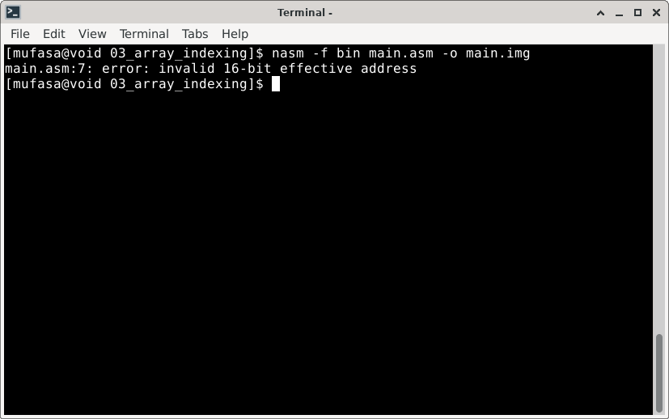

# Valid Registers For Memory Addressing

> **Random Quote**: The price of excellence is discipline; The cost of mediocrity is disappointment.

This file answers the following question:

> Which registers can be used as base or index registers in 16-bit addressing modes?

---

## Valid Registers for Memory Addressing

In x86 real mode (16-bit), only a limited set of general-purpose registers are valid for forming memory addresses. The following 16-bit registers may be used to form effective addresses:

+ **Base Registers:** `BX`, `BP`
+ **Index Registers:** `SI`, `DI`

These registers can also be combined with optional displacements or paired together, as shown in the table below.

| Addressing Form                                            | Explanation                                    |
| ---------------------------------------------------------- | ---------------------------------------------- |
| `[BX]`, `[BP]`, `[SI]`, `[DI]`                             | Single-register indirect addressing            |
| `[BX + disp]`, `[BP + disp]`, `[SI + disp]`, `[DI + disp]` | Single-register with displacement              |
| `[BX + SI]`, `[BX + DI]`, `[BP + SI]`, `[BP + DI]`         | Two-register based/indexed addressing          |
| `[BX + SI + disp]`, etc.                                   | Combination of two registers plus displacement |

---

## Invalid Registers

All other general-purpose registers, such as `AX`, `CX`, `DX`, or `SP` are not valid for memory addressing. Any attempt to use them in a memory operand will result in assembler errors like the one shown below:



This specific error was caused by this assembly line:

```assembly
mov al, [cx]    ; CX is an invalid index register.
```

---

## Why This Restriction Exists

The 8086 architecture uses a fixed ModR/M encoding scheme for memory operands in 16‑bit mode. Only `BX`, `BP`, `SI`, and `DI` are defined in this scheme as valid base or index registers. Using any other register violates these encoding rules and results in an assembly error.

---
