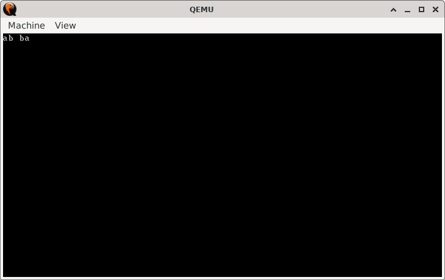

# Swap and Show

> **Random Quote:** Don't count the days, make the days count.

## Key Topics

+ [Objective](#objective)
    - [Code Summary](#code-summary)
+ [Practice Areas](#practice-areas)
+ [Run](#run)
+ [Output and Explanation](#output-and-explanation)

---

## Objective

Write a program that swaps two variables using the `XCHG` instruction.

### Code Summary

1. Declare two variables using `DB`.
2. Print the variables using `BIOS INT 10h, AH=0Eh`.
3. Swap the variables using `XCHG`.
4. Print the swapped values.
5. Halt.

---

## Practice Areas

This project will help you bild intuition around:

+ **The `MOV` instruction**: Moving data from memory to registers and between registers.
+ **The `XCHG` instruction**: Swapping values without using a temporary register.
+ **Memory declaration using `DB`**: Storing values directly in memory.
+ **Basic character output using BIOS**: Printing characters using `INT 10h, AH=0Eh`.
+ **Program structure and flow**: Building a minimal program from data definition to output.

---

## Run

To run the bootloader, execute the `run.sh` script.

```sh
./run.sh
```

The script uses `NASM` to assemble `main.asm` into a bootable flat binary (`main.img`) and launches it in QEMU for testing.

---

## Output and Explanation

When you run the program, you will get this output:



### What This Means

+ The first part `ab` is the original content of the two variables before swapping.
    - Variable `one` holds `a`.
    - Variable `two` holds `b`.
    - These are printed in order using BIOS interrupt `INT 10h`.

+ The second part (after the space) `ba`, is the output after the variables have been swapped using the `XCHG` instruction.
    - Now `one` holds `b` and
    - `two` holds `a`.
    - The swapped values are printed in the same order, demonstrating that the exchange was successful.

This verifies that the `XCHG` instruction worked as expected, swapping the values directly in memory without using an intermediate register.
