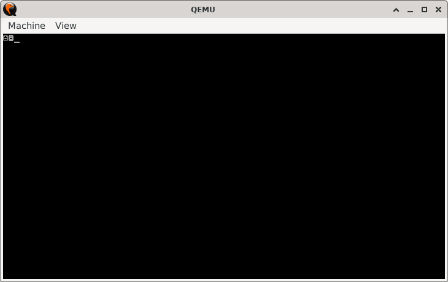

# Bugs

> **Random Quote:** The way to get started is to quit talking and begin doing.

This file documents bugs encountered while working on this project, along with explanations of their causes and the steps taken to fix them. Each entry serves as a reference to avoid repeating the same mistakes and to deepen understanding of the underlying concepts.

---

## Character Confusion

**Date:** 2025-07-04
**Status:** Fixed

### Problem

`BIOS INT 10h, AH=0Eh` printed garbage characters; specifically, smiley faces. The output is shown in the image below:



This occurred while attempting to print the characters `1` and `2`.

### Cause

This issue occurred because I moved raw decimal values instead of character literals into the `AL` register.

```asm
; When printing
mov al, [one]
...
mov al, [two]

; The variables
one db 1
two db 2
```

Note that `one` and `two` are defined as numeric literals, not character constants. `BIOS INT 10h, AH=0Eh` mapped the decimal numbers to ASCII characters. In this case, the faces in the output were the ASCII characters.

### Fix

Use strings instead of decimal numbers.

```asm
one db '1'
two db '2'
```

This ensures that `INT 10h` prints the intended ASCII characters to the screen.

### Notes

+ Always use character literals when invoking BIOS video services for text output.
