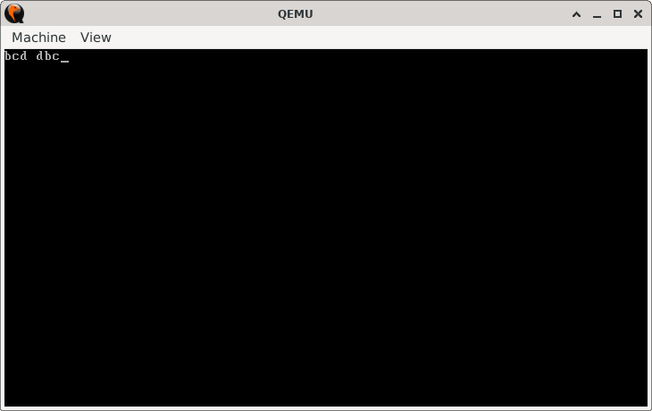

# Register Shuffle

> **Random Quote:** There are no shortcuts to any place worth going.

## Key Topics

+ [Objective](#objective)
    - [Code Summary](#code-summary)
+ [Practice Areas](#practice-areas)
+ [Run](#run)
+ [Output and Explanation](#output-and-explanation)

---

## Objective

Write a program that rotates the values of three 8-bit registers using only the `XCHG` instruction.

The goal is to perform a circular rotation such that:

+ The original value in `BL` moves to `CL`.
+ The value in `CL` moves to `DL`.
+ The value in `DL` moves to `BL`.

### Code Summary

1. Initialize `BL`, `CL`, and `DL` with distinct character values.
2. Print the values using `BIOS INT 10h, AH=0Eh`.
3. Use a sequence of `XCHG` instructions to rotate the values across the three registers.
4. Print the rotated values.
5. Halt the system.

---

## Practice Areas

This project will help you build deeper understanding of:

+ **Register manipulation**: Working directly with general-purpose 8-bit registers.
+ **The `XCHG` instruction**: Using only register-register swaps to implement cyclic movement of values.
+ **Register-based output**: Printing character values directly from registers using BIOS interrupts.
+ **Instruction sequencing**: Achieving a non-trivial transformation using only a restricted instruction set.
+ **Flow control in a minimal program**: Structuring setup, processing, and output in a tight bootloader-style binary.

---

## Run

To run the bootloader, execute the `run.sh` script.

```sh
./run.sh
```

The script uses `NASM` to assemble `main.asm` into a bootable flat binary (`main.img`) and launches it in QEMU for testing.

---

## Output and Explanation

When you run the program, you will get this output:



### What This Means

+ The first part `bcd` is the original content of the registers before shuffling.

    - `BL` contains `'b'`.
    - `CL` contains `'c'`.
    - `DL` contains `'d'`.
    - These are printed in order using BIOS interrupt `INT 10h`.

+ The second part (after the space) `dbc`, is the output after the register values have been shuffled using the `XCHG` instruction.

    - Now `BL` contains `'d'`,
    - `CL` contains `'b'`, and
    - `DL` contains `'c'`.
    - The swapped values are printed in the same order, demonstrating that the shuffle was successful.

This verifies that the `XCHG` instruction worked as expected, shuffling the values between registers without using an intermediate register.
