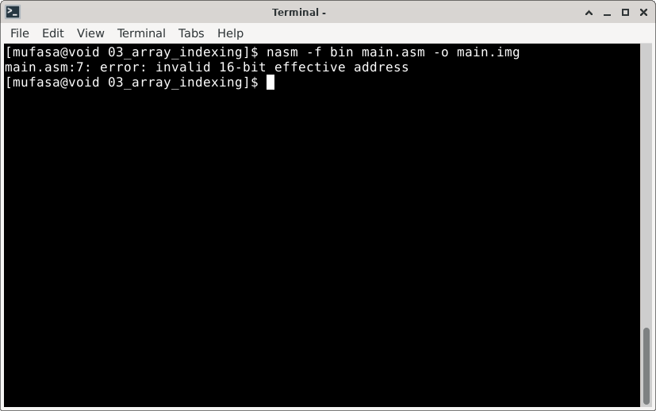

# Bugs

> **Random Quote:** Discipline is doing what needs to bd done, even if you don't want to do it.

---

## Invalid Register for Memory Operand

**Date**: 2025-07-15
**Status**: Fixed

### Problem

While assembling the program, NASM raised an error when attempting to access memory using the `CX` register as an index.

**Error screenshot:**




### Cause

The error occurred because `CX` is not a valid register for use as a memory index in 16-bit addressing. Using it in a memory operand like `[cx]` is invalid and causes the assembler to fail.

```assembly
lea cx, [vowels + 2]    ; CX = memory address of 3rd vowel.

; Try to print the vowel at memory address [CX].
mov ah, 0x0E
mov al, [cx]            ; Invalid: CX cannot be used as an index.
mov bh, 0
int 0x10

; Declare vowels.
vowels db "aeiou"
```

### Fix

Use a valid index register when dereferencing memory.

```assembly
lea si, [vowels + 2]
...
mov al, [si]    ; This will work.
```

### Reference

For more details on valid addressing modes, see [this file](#).
