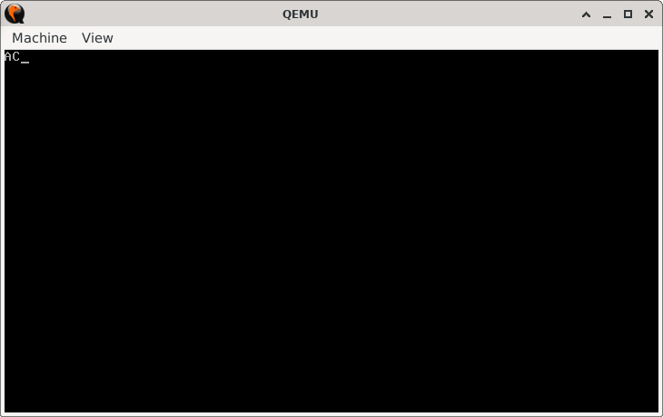

# Operation Skip-B

> **Random Quote:** Sometimes the best way to say something… is to not say it at all.  

## Sections

+ [Overview](#overview)
    - [Objectives](#objectives)
+ [How It Works](#how-it-works)
+ [Practice Areas](#practice-areas)
+ [Running the Project](#running-the-project)
+ [Output and Explanation](#output-and-explanation)
+ [Notes](#notes)

---

## Overview

This project demonstrates the use of the unconditional `JMP` instruction to skip over code.  
It prints the letter "A", jumps over the code that would print "B", and then prints "C".  

### Objectives

+ Show how `JMP` can unconditionally alter program flow.  
+ Verify the skip visually by omitting a section of output.  

---

## How It Works

1. The video mode is set to 80x25 text mode for a clean output screen.  
2. The program prints the letter "A".  
3. `JMP` is used to skip the section of code that would print "B".  
4. The program resumes execution by printing "C".  
5. The CPU is halted.  

---

## Practice Areas

+ Using `JMP` for unconditional jumps.  
+ Controlling program flow explicitly.  
+ Printing characters using BIOS interrupt `INT 10h`.  
+ Structuring simple real-mode boot sector programs.  

---

## Running the Project

To run the bootloader, execute the `run.sh` script.

```sh
./run.sh
```

The script uses `NASM` to assemble `main.asm` into a bootable flat binary (`main.img`) and launches it in QEMU for testing.

---

## Output and Explanation

Here's the output I got:



The missing "B" shows that `JMP` successfully skipped over the code that would have printed it.

---

## Notes

* This example is deliberately simple to clearly demonstrate `JMP` without distractions.
* In real programs, unconditional jumps are often used to skip optional code blocks, exit loops early, or jump to error handling routines.

---
