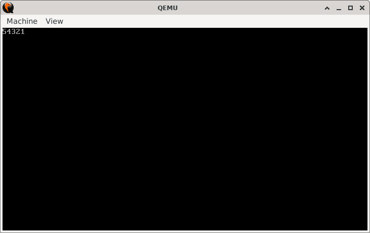

# Blastoff Countdown

> **Random Quote:** Let him who desires peace, prepare for war.

## Sections

+ [Overview](#overview)
    - [Objectives](#objectives)
+ [How It Works](#how-it-works)
+ [Practice Areas](#practice-areas)
+ [Running the Project](#running-the-project)
+ [Output and Explanation](#output-and-explanation)
+ [Notes](#notes)

---

## Overview

This project demonstrates the use of the `LOOP` instruction in x86 real-mode assembly to perform a countdown.  
Starting from a given number, the program prints each value down to 1 before halting.

### Objectives

+ Practice using the `LOOP` instruction to control iteration.
+ Display numeric countdown output in text mode.
+ Reinforce real-mode BIOS text printing using `INT 10h`.

---

## How It Works

1. Set video mode to 80x25 text mode (clearing the screen in the process).
2. Initialize the BIOS teletype output parameters (`AH=0x0E`, page number in `BH`).
3. Load the loop counter (`CX`) with the starting value defined by `LOOP_COUNT`.
4. At each iteration:
   - Move the current value of `CL` into `AL`.
   - Convert the value to its ASCII character code by adding `'0'`.
   - Print it using BIOS interrupt `INT 10h`.
   - Decrement `CX` and loop back if not zero.
5. Halt the CPU when finished.

---

## Practice Areas

+ Using the `LOOP` instruction to automatically decrement and branch.
+ Converting integers to ASCII for display.
+ BIOS teletype output via `INT 10h`.
+ Structuring minimal boot sector programs in 16-bit real mode.
+ Using `EQU` for symbolic constants.

---

## Running the Project

To run the bootloader, execute the `run.sh` script.

```sh
./run.sh
```

The script uses `NASM` to assemble `main.asm` into a bootable flat binary (`main.img`) and launches it in QEMU for testing.

---

## Output and Explanation

This is the output I got when I ran the program:



The numbers count down from `5` to `1`.
Each iteration prints the current loop counter before decrementing.
When the counter reaches zero, the program halts.

This shows that the LOOP instruction continues to loop until CX reaches 0.

---

## Notes

* Because only a single digit is printed, this project works for loop counts up to 9 without modification.
* For counts ≥ 10, additional code is required to handle multi-digit ASCII conversion.
* Using `EQU` for `LOOP_COUNT` makes changing the starting number easy without modifying code logic.

---
