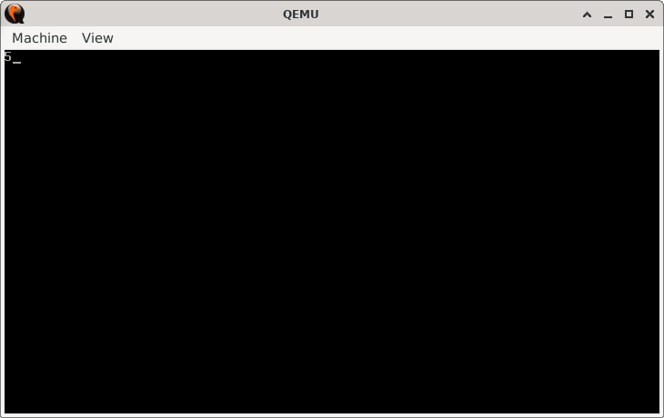

# Repeat Radar

> **Random Quote:** Repetition is the mother of learning.

## Sections

+ [Overview](#overview)
    - [Objectives](#objectives)
+ [How It Works](#how-it-works)
+ [Practice Areas](#practice-areas)
+ [Running the Project](#running-the-project)
+ [Output and Explanation](#output-and-explanation)
+ [Notes](#notes)

---

## Overview

This project counts how many times a specific character is repeated consecutively in a string using the `LOOPE` instruction in real mode. The result is printed directly to the screen using BIOS interrupts.

### Objectives

+ Practice the `LOOPE` instruction for loop control.
+ Use a register (`CX`) as a counter for repetitions.
+ Access characters in a string using `SI`.
+ Print numerical output using BIOS teletype mode.

---

## How It Works

1. **Initialize video mode** to 80×25 color text mode using BIOS interrupt `INT 10h` function `AH = 00h`.
2. **Load the counter** (`CX`) with the maximum number of repetitions to check (`MAX_REP`).
3. **Load the string address** into `SI` using `LEA`.
4. **Check the first character** to ensure it matches the target repeated character (`REP_CHAR`).
5. If it matches, enter a loop:
    - Advance `SI` to the next character.
    - Compare it to `REP_CHAR`.
    - Use `LOOPE` to repeat the loop while the character matches and `CX` is not zero.
6. **Calculate repetitions** by subtracting the remaining `CX` from `MAX_REP`.
7. **Convert the count** to an ASCII digit by adding `'0'` to `AL`.
8. **Print the result** using BIOS teletype mode (`INT 10h`, `AH = 0Eh`).
9. Halt the CPU.

---

## Practice Areas

+ Using `LOOPE` for controlled looping with a counter and conditional checks.
+ Setting and clearing the screen with BIOS video mode calls.
+ Loading effective addresses into registers with `LEA`.
+ Accessing string elements via register indexing.
+ Converting numeric values to ASCII for display.
+ Writing minimal real-mode boot code.

---

## Running the Project

To run the bootloader, execute the `run.sh` script.

```sh
./run.sh
```

The script uses `NASM` to assemble `main.asm` into a bootable flat binary (`main.img`) and launches it in QEMU for testing.

---

## Output and Explanation

Here's the output I got:



Explanation:
The first five characters of the string are `'a'`. The program counts these repetitions using `LOOPE` and prints the count (`5`). The loop terminates as soon as a different character (`'b'`) is encountered or `CX` reaches zero.

---

## Notes

* `LOOPE` decreases `CX` and continues looping only if `ZF = 1` (comparison matched) and `CX != 0`.
* This approach can be adapted to scan for patterns in longer text buffers by adjusting `MAX_REP` and removing the early termination after a mismatch.
* In a real OS dev scenario, such logic could be part of text parsing routines or data validation checks.

---
