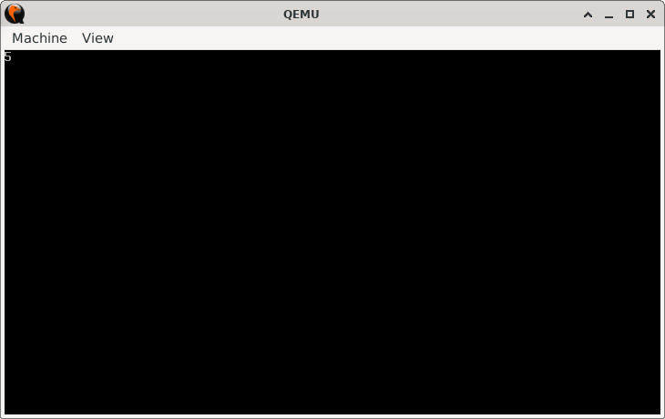

# DiffSniffer

> **Random Quote:** The difference between something good and something great is attention to detail.

## Sections

+ [Overview](#overview)
    - [Objectives](#objectives)
+ [How It Works](#how-it-works)
+ [Practice Areas](#practice-areas)
+ [Running the Project](#running-the-project)
+ [Output and Explanation](#output-and-explanation)
+ [Notes](#notes)

---

## Overview

This project compares two strings character by character in 16-bit real mode.  
It uses the `LOOPE` instruction to continue looping as long as the characters match and the loop counter is not zero.  
When a mismatch is found, the program prints the position of the mismatch on the screen.

### Objectives

+ Compare two strings byte by byte.
+ Stop looping if characters differ or if the loop counter becomes zero.
+ Print the index of the first mismatch.

---

## How It Works

1. Set the video mode to 80x25 text mode using BIOS interrupt `10h`.
2. Load the addresses of `string1` and `string2` into `SI` and `DI`.
3. Set the loop counter (`CX`) to 10.
4. In each iteration:
   + Load one character from `string1` into `BH`.
   + Load one character from `string2` into `BL`.
   + Compare the two characters.
   + Continue looping with `LOOPE` if they match and `CX` is not zero.
5. Once the loop exits, calculate the mismatch index using the remaining value in `CX`.
6. Print the index on the screen using BIOS teletype output (`INT 10h` with AH = 0x0E).
7. Halt the CPU.

---

## Practice Areas

This project reinforces the following skills:

+ Using `LOOPE` to control a loop based on both equality and counter value.
+ Comparing bytes with `CMP`.
+ Managing loop counters with `CX`.
+ Printing characters with BIOS interrupt `10h`.
+ Writing and structuring a simple boot sector program.

---

## Running the Project

To run the bootloader, execute the `run.sh` script.

```sh
./run.sh
```

The script uses `NASM` to assemble `main.asm` into a bootable flat binary (`main.img`) and launches it in QEMU for testing.

---

## Output and Explanation

This is the output I got when I ran the program:



The program prints `5` because it found the mismatch at position 5 (the character `'l'` in `string1` vs `'1'` in `string2`).
This confirms that the comparison worked correctly.

---

## Notes

* The program makes these assumptions:

    * A mismatch will exist between the two strings.
    * The mismatch index will not exceed 9, since only single-digit output is supported.
* The loop counter (`CX`) determines the maximum number of characters compared. In this program it is set to 10, therefore, the length of the string must not exceed 10 characters.
* The printed index is a single digit (0–9). For larger strings, further logic would be needed to print multi-digit numbers.

---
