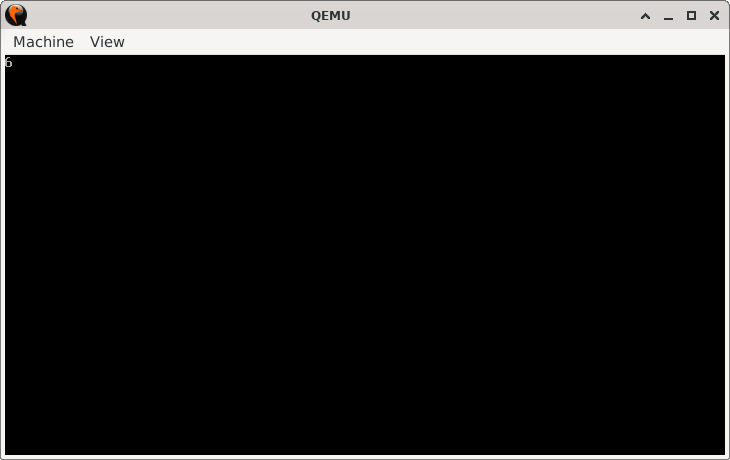

# CharHunt

> **Random Quote:** There is no honor in sending people to die for something you wouldn't fight for yourself.

## Sections

+ [Overview](#overview)
    - [Objectives](#objectives)
+ [How It Works](#how-it-works)
+ [Practice Areas](#practice-areas)
+ [Running the Project](#running-the-project)
+ [Output and Explanation](#output-and-explanation)
+ [Notes](#notes)

---

## Overview

This project demonstrates how to locate the first occurrence of a given character in a string using the `LOOPNE` instruction.

### Objectives

+ Practice using the `LOOPNE` instruction for conditional looping.
+ Search for the first occurrence of a target character in a string.
+ Print the index of the first occurrence.

---

## How It Works

1. **Initialize video mode** to 80×25 text mode using BIOS interrupt `INT 10h`.
2. **Prepare the loop**:
   + Load `CX` with `MAX` to limit the number of search iterations.
   + Store the target character (`CHAR`) in `BH`.
   + Load the address of the string into `SI`.
3. **Search loop (`find_char`)**:
   + Load the current character into `BL`.
   + Increment `SI` to point to the next character.
   + Compare `BL` with `BH`.
   + If not equal, decrement `CX` and continue looping (`LOOPNE`).
   + If equal or `CX` reaches zero, exit the loop.
4. **Calculate index**:
   + Subtract the remaining `CX` from the maximum index (14).
   + Convert the result into ASCII by adding `'0'`.
5. **Print the index** using BIOS teletype output (`INT 10h`).
6. Halt the CPU.

---

## Practice Areas

+ Using `LOOPNE` to combine counter-based looping with condition checking.
+ Loading and comparing characters from a string.
+ Managing string traversal with `SI`.
+ Converting numeric values into ASCII characters for display.
+ Writing minimal real-mode boot code that performs a search task.

---

## Running the Project

To run the bootloader, execute the `run.sh` script.

```sh
./run.sh
```

The script uses `NASM` to assemble `main.asm` into a bootable flat binary (`main.img`) and launches it in QEMU for testing.

---

## Output and Explanation

This is the output I got when I ran the program:



Explanation:
The target character `'w'` first occurs at index `6` (zero-based). The program loops through the string, finds the match, computes the index, and prints it.

---

## Notes

* **Assumptions**:

  * The string contains the target character.
  * The index of the target character is less than `MAX`.
* Extending the program to handle longer strings would require dynamically handling `MAX` and possibly multi-digit index output.

---
