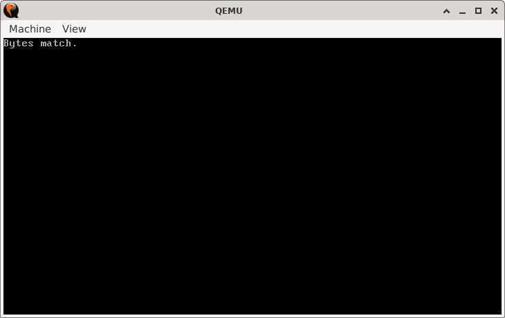
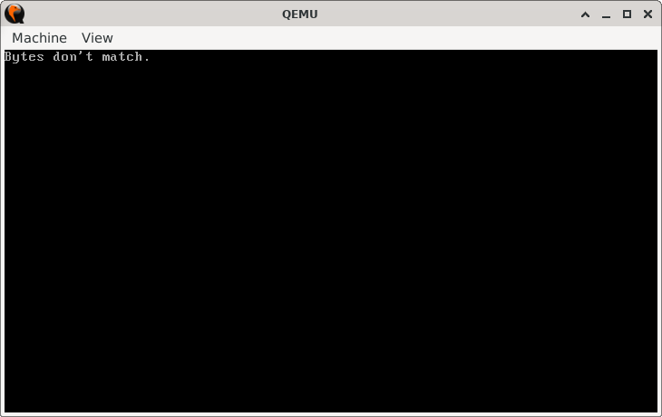

# ByteMatcher

> **Random Quote**: Small steps build the foundation for great achievements.

## Sections

+ [Overview](#overview)
    - [Objectives](#objectives)
+ [How It Works](#how-it-works)
+ [Practice Areas](#practice-areas)
+ [Running the Project](#running-the-project)
+ [Output and Explanation](#output-and-explanation)
+ [Notes](#notes)

---

## Overview

This project demonstrates how to compare two predefined bytes in memory and display a message indicating whether they match.  

### Objectives

+ Compare two byte values stored as constants.  
+ Use conditional jumps to branch depending on equality.  
+ Print the result message directly on the screen.  
+ Halt the CPU safely after execution.  

---

## How It Works

1. The program begins by setting the video mode to 80x25 text mode and clearing the screen.  
2. Two bytes (`first_byte` and `second_byte`) are defined at assembly time.  
3. The program compares these two values using the `CMP` instruction.  
4. If the values are equal, execution jumps to the `equal` label and prints the "Bytes match." message.  
5. If the values are not equal, execution jumps to the `not_equal` label and prints the "Bytes don't match." message.  
6. After printing, the program halts execution using `HLT`.  

---

## Practice Areas

This project helps reinforce several fundamental assembly concepts:  

+ Using the `CMP` instruction to compare values.  
+ Applying conditional jumps (`JE`, `JMP`) to control program flow.  
+ Printing characters and strings with BIOS interrupt `INT 10h`.  
+ Implementing simple subroutines (`print_string`, `print`).  
+ Structuring a minimal bootable real-mode program.  

---

## Running the Project

To run the bootloader, execute the `run.sh` script.

```sh
./run.sh
```

The script uses `NASM` to assemble `main.asm` into a bootable flat binary (`main.img`) and launches it in QEMU for testing.

---

## Output and Explanation

Here's the output when `first_byte = 'a'` and `second_byte = 'a'`:



Here's the output when `first_byte = 'a'` and `second_byte = 'b'`:



This confirms that the program correctly branches based on the comparison result.

---

## Notes

* This program is intentionally made simple to focus on learning how to use `JE` / `JZ` to control program flow.

---
