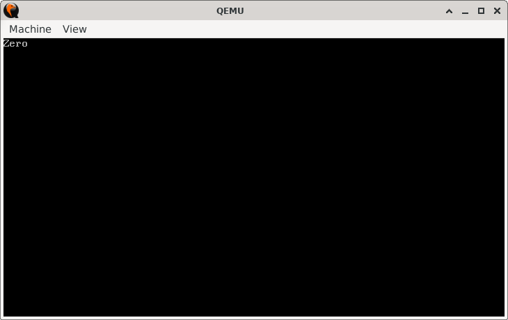
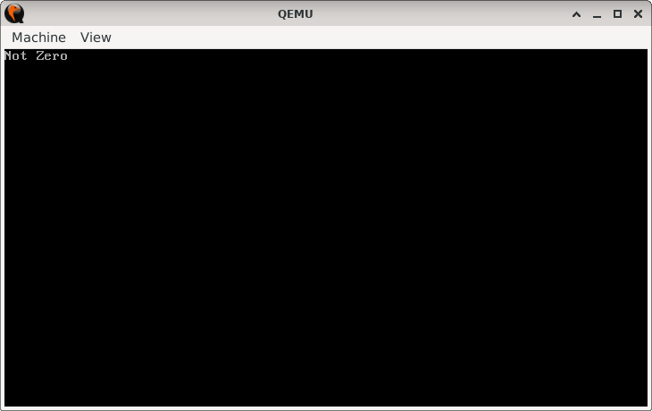

# ZeroCheck

> **Random Quote:** It's not about money or connections; it's the willingness to outwork and outlearn everyone.

## Sections

+ [Overview](#overview)
    - [Objectives](#objectives)
+ [How It Works](#how-it-works)
+ [Practice Areas](#practice-areas)
+ [Running the Project](#running-the-project)
+ [Output and Explanation](#output-and-explanation)
+ [Notes](#notes)

---

## Overview

This project demonstrates how to check whether a predefined variable is equal to zero and display a corresponding message.

### Objectives

+ Compare a predefined constant with zero.
+ Use conditional jumps to determine execution flow.
+ Display different messages depending on the comparison result.
+ Halt the CPU after execution is complete.

---

## How It Works

1. The program begins execution at `0x7C00` in 16-bit real mode.
2. The display is set to 80x25 text mode using BIOS interrupt `INT 10h` to ensure a clean output environment.
3. The program loads the constant `NUM` into the `AL` register.
4. A comparison (`CMP`) is made between the value in `AL` and zero.
5. If the value is not zero, the program jumps to the `not_zero` label and prints "Not Zero".
6. If the value equals zero, the program jumps to the `zero` label and prints "Zero".
7. A helper procedure `print_message` iterates through each character of a null-terminated string and prints it using BIOS interrupt `INT 10h` function `0x0E`.
8. After the message is displayed, the program halts the CPU with `HLT`.

---

## Practice Areas

+ Using `CMP` to compare values in registers.
+ Applying conditional jumps (`JNZ`, `JMP`) for program flow control.
+ Writing and calling procedures in assembly (`print_message` and `print_char`).
+ Displaying characters using BIOS interrupt `INT 10h` in real mode.
+ Constructing a minimal bootable program with a clear branching structure.

---

## Running the Project

To run the bootloader, execute the `run.sh` script.

```sh
./run.sh
```

The script uses `NASM` to assemble `main.asm` into a bootable flat binary (`main.img`) and launches it in QEMU for testing.

---

## Output and Explanation

### Case 1: NUM = 0



### Case 2: NUM = 7



The output confirms that the comparison and conditional jumps behave as expected.

---

## Notes

* The constant `NUM` can be adjusted to test different conditions without modifying the core logic.
* The design showcases a fundamental programming pattern: **comparison + conditional branching**.
* This project forms a foundation for more complex decision-making routines in real-mode operating systems.
* BIOS interrupt usage ensures compatibility with basic emulators such as QEMU or Bochs.

---
