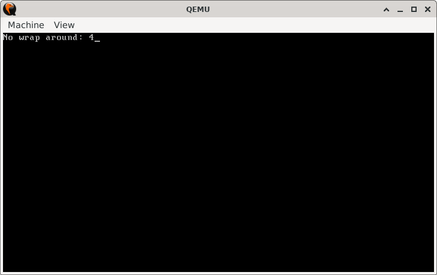
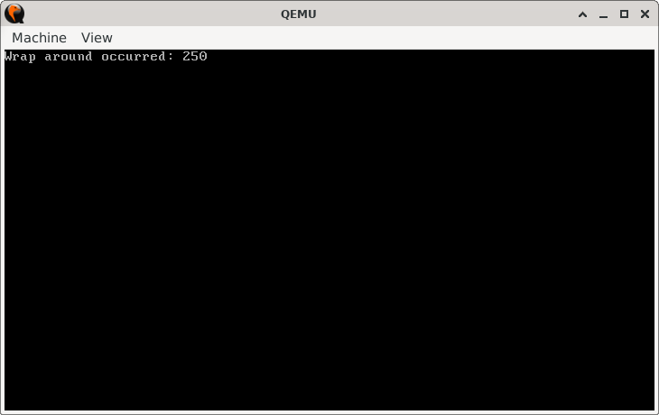

# WrapAroundCheck

> **Random Quote**: Success is the sum of small efforts, repeated day in and day out.

## Sections

+ [Overview](#overview)  
    - [Objectives](#objectives)  
+ [How It Works](#how-it-works)  
+ [Practice Areas](#practice-areas)  
+ [Running the Project](#running-the-project)  
+ [Output and Explanation](#output-and-explanation)  
+ [Notes](#notes)  

---

## Overview

This project demonstrates how to subtract two **unsigned numbers** in 16-bit x86 real mode and detect whether the result causes an underflow (i.e., a wrap-around).  
It introduces the use of the **Carry Flag (CF)** as an indicator of underflow in unsigned arithmetic.  

### Objectives

+ Subtract two unsigned numbers using the `SUB` instruction.  
+ Detect underflow by checking the Carry Flag with `JC`.  
+ Print different messages depending on whether underflow occurred.  
+ Display the resulting value after subtraction.  

---

## How It Works

1. The program initializes the video mode (80x25 text mode) and clears the screen.  
2. Two unsigned constants (`NUM1` and `NUM2`) are defined. The program performs the subtraction `NUM1 - NUM2`.  
3. After the subtraction, the Carry Flag (CF) is checked:  
   - If `CF = 1`, an underflow has occurred, and the program jumps to the **underflow handler**.  
   - If `CF = 0`, no underflow occurred.  
4. A corresponding message is printed: either `"Wrap around occurred: "` or `"No wrap around: "`.  
5. The program then converts the numerical result into its decimal string representation and prints it to the screen.  
6. Execution halts cleanly after output.  

---

## Practice Areas

This project reinforces several important concepts in low-level programming:

+ Using the `SUB` instruction for unsigned arithmetic.  
+ Understanding and applying the **Carry Flag (CF)** for underflow detection.  
+ Using conditional jumps (`JC`) to handle arithmetic outcomes.  
+ Converting a numeric result into a human-readable decimal string.  
+ Organizing real-mode assembly programs with procedures (e.g., string printing).  

---

## Running the Project

To run the bootloader, execute the `run.sh` script.

```sh
./run.sh
```

The script uses `NASM` to assemble `main.asm` into a bootable flat binary (`main.img`) and launches it in QEMU for testing.

---

## Output and Explanation

Example 1 (when `NUM1 = 5`, `NUM2 = 1`):



Here, the subtraction `5 - 1 = 4` does not cause underflow, so the program prints the corresponding message and the result.

Example 2 (when `NUM1 = 5`, `NUM2 = 11`):



Since unsigned arithmetic wraps around modulo 256, the result of `5 - 11` is `250` (in 8-bit). The program detects the underflow and prints the appropriate message.

---

## Notes

* The program assumes 8-bit unsigned subtraction (`NUM1` and `NUM2` fit within a byte).
* The Carry Flag (CF) is the correct indicator of underflow in unsigned arithmetic; the Sign Flag (SF) and Overflow Flag (OF) apply to signed interpretation.
* Extending the program to larger values would require widening the registers (e.g., using `AX` instead of `DL`).

---
