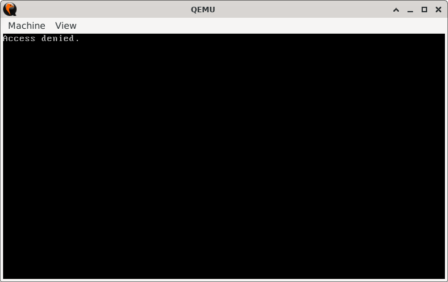
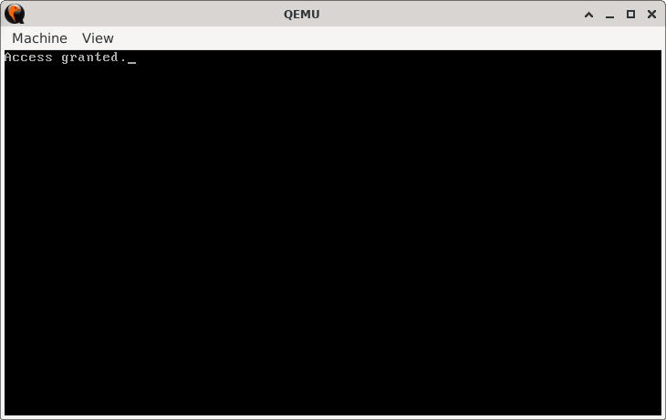

# AgeGate

## Sections

+ [Overview](#overview)
    - [Objectives](#objectives)
+ [How It Works](#how-it-works)
+ [Practice Areas](#practice-areas)
+ [Running the Project](#running-the-project)
+ [Output and Explanation](#output-and-explanation)
+ [Notes](#notes)

---

## Overview

This project demonstrates how to compare an unsigned value against a threshold and conditionally execute code based on the comparison result.  
It simulates an age check scenario where access is granted if the value is above or equal to 18.  

### Objectives

+ Use the `CMP` instruction to compare values.  
+ Apply conditional jumps (`JAE`) to control program flow for unsigned comparisons.  
+ Display messages depending on the outcome of the comparison.  
+ Practice organizing minimal real-mode assembly programs with reusable procedures.  

---

## How It Works

1. The program initializes the video mode to 80x25 text mode and clears the screen.  
2. A constant `AGE` is defined, representing the value to check.  
3. The program compares `AGE` with the threshold value `18` using `CMP`.  
4. Based on the comparison:  
   - If `AGE >= 18`, the program jumps to `grant_access` and prints `"Access granted."`.  
   - If `AGE < 18`, the program jumps to `deny_access` and prints `"Access denied."`.  
5. The printing procedure reads a null-terminated string from memory and outputs each character using BIOS teletype services.  
6. Execution halts cleanly after the message is printed.  

---

## Practice Areas

+ Using `MOV` to load values into registers.  
+ Comparing unsigned numbers using `CMP`.  
+ Controlling program flow with conditional jumps (`JAE`/`JNB`).  
+ Printing null-terminated strings in real mode using BIOS interrupts.  
+ Structuring minimal assembly programs with reusable procedures.  

---

## Running the Project

To run the bootloader, execute the `run.sh` script.

```sh
./run.sh
```

The script uses `NASM` to assemble `main.asm` into a bootable flat binary (`main.img`) and launches it in QEMU for testing.

---

## Output and Explanation

**Example 1**: When `AGE == 7`.



The program detects that the age is below the threshold and prints the corresponding message.

**Example 2**: When `AGE == 70`.



The program detects that the age meets the threshold and prints the appropriate message.

---

## Notes

* The comparison uses **unsigned logic**, so `JAE` (Jump if Above or Equal) is used rather than a signed jump.
* The printing routine assumes null-terminated strings and uses BIOS interrupt `0x10` for output.
* The program can be adapted for other thresholds or values by changing the `AGE` constant.

---
