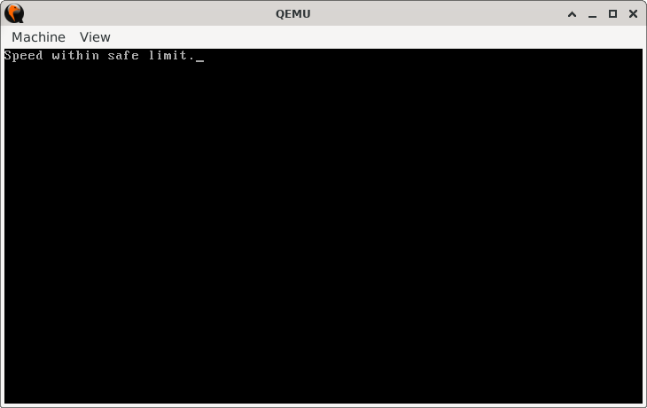
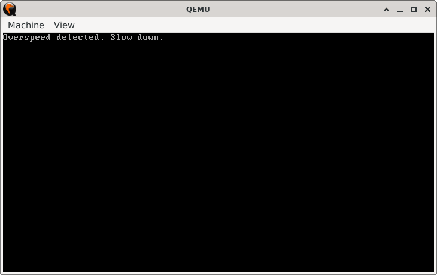

# SpeedGovernor

## Sections

+ [Overview](#overview)
    - [Objectives](#objectives)
+ [How It Works](#how-it-works)
+ [Practice Areas](#practice-areas)
+ [Running the Project](#running-the-project)
+ [Output and Explanation](#output-and-explanation)
+ [Notes](#notes)

---

## Overview

This project demonstrates how to compare an unsigned value against a maximum threshold and branch execution based on whether the value is within the limit or exceeds it.  
In this case, the program checks a predefined "speed" value and enforces an upper limit of **80 km/h**, mimicking the behavior of a speed governor in real-world systems.

### Objectives

+ Compare an unsigned integer against a constant threshold.  
+ Use conditional jumps (`JBE`, `JMP`) to branch program flow.  
+ Display appropriate status messages depending on the comparison result.  
+ Reinforce practice with BIOS interrupts for printing to the screen.

---

## How It Works

1. The program defines a constant `SPEED`.  
2. The video mode is set to text mode (80x25) and the screen is cleared.  
3. The program compares `SPEED` with `80`.  
   - If `SPEED` is **below or equal to 80**, execution jumps to the `safe_speed` label.  
   - If `SPEED` is **greater than 80**, execution jumps to the `slow_down` label.  
4. Depending on the branch taken, the corresponding message is printed using BIOS interrupt `INT 10h`.  
5. The CPU halts after displaying the message.

---

## Practice Areas

This project provides practice with:

+ Using `CMP` for unsigned comparisons.  
+ Applying conditional jump instructions (`JBE`) in control flow.  
+ Printing strings and characters with `INT 10h` BIOS services.  
+ Designing simple real-mode assembly programs that simulate real-world checks.

---

## Running the Project

To run the bootloader, execute the `run.sh` script.

```sh
./run.sh
```

The script uses `NASM` to assemble `main.asm` into a bootable flat binary (`main.img`) and launches it in QEMU for testing.

---

## Output and Explanation

If `SPEED` is **45**, the output is:



If `SPEED` is set to **100**, the output is:



This demonstrates the use of conditional branching to enforce limits based on unsigned integer comparison.

---

## Notes

* The threshold (80 km/h) can be adjusted by modifying the comparison constant.
* This logic can be adapted for many real-world checks, such as limiting resource usage, validating sensor data, or enforcing system constraints.
* The project illustrates how assembly-level constructs map directly onto everyday control systems.

---
