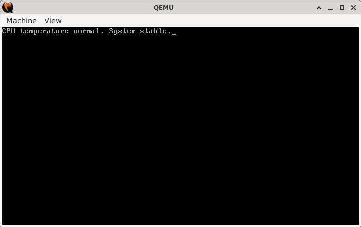
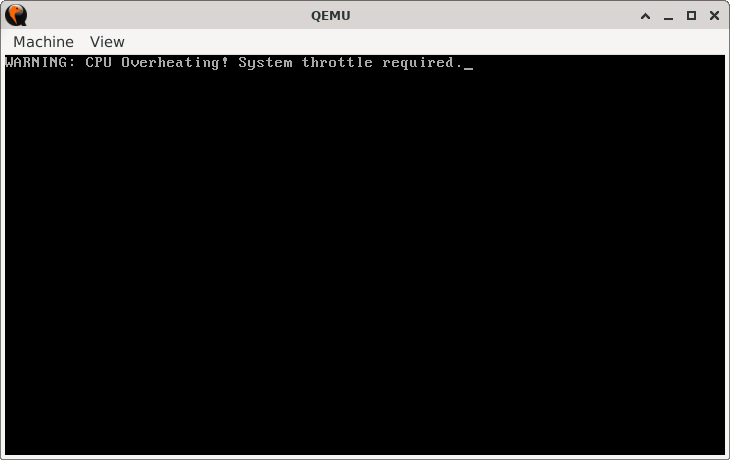

# OverheatTrigger

> **Random Quote**: Great things come from hard work and perseverance. No excuses.

## Sections

+ [Overview](#overview)
    - [Objectives](#objectives)
+ [How It Works](#how-it-works)
+ [Practice Areas](#practice-areas)
+ [Running the Project](#running-the-project)
+ [Output and Explanation](#output-and-explanation)
+ [Notes](#notes)

---

## Overview

This project simulates a simple CPU temperature check. The program compares the current CPU temperature against a maximum safe threshold. If the CPU temperature exceeds the threshold, a warning message is displayed; otherwise, a safe status message appears.

### Objectives

+ Practice comparing two values using `CMP`.
+ Learn how to branch when a value is strictly greater with `JA`.
+ Display different messages depending on the result.

---

## How It Works

1. Set the video mode to 80x25 text mode and clear the screen.  
2. Load the current CPU temperature into a register.  
3. Compare the temperature with the maximum allowed threshold.  
4. If the temperature is strictly greater (`JA`), display the overheat warning.  
5. Otherwise, display the safe temperature message.  
6. Halt the CPU.

---

## Practice Areas

+ Using `CMP` with unsigned comparisons.  
+ Branching with `JA` for "strictly greater than."  
+ Printing strings using BIOS interrupt `INT 10h`.  
+ Structuring minimal real-mode assembly programs.  

---

## Running the Project

To run the bootloader, execute the `run.sh` script.

```sh
./run.sh
```

The script uses `NASM` to assemble `main.asm` into a bootable flat binary (`main.img`) and launches it in QEMU for testing.

---

## Output and Explanation

Output when `CPU_TEMP == 80`:



Output when `CPU_TEMP == 120`:



This confirms that the comparison and branching logic work as intended.

---

## Notes

* This project demonstrates how to handle **strictly greater-than checks** in unsigned logic.
* In real systems, such checks can be tied to hardware interrupts or thermal management routines.
* You can experiment by changing `CPU_TEMP` and `MAX_TEMP` values to see how the output changes.

---
