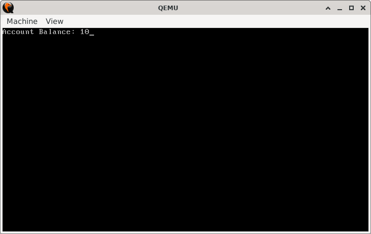
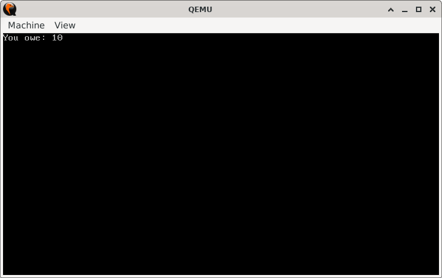

# DebtDetector

> **Random Quote**: There is no substitute for hard work.

## Sections

+ [Overview](#overview)
    - [Objectives](#objectives)
+ [How It Works](#how-it-works)
+ [Practice Areas](#practice-areas)
+ [Running the Project](#running-the-project)
+ [Output and Explanation](#output-and-explanation)
+ [Notes](#notes)

---

## Overview

This project simulates a simple banking scenario where a user attempts to withdraw money from their account. If the withdrawal is within or equal to the account balance, the remaining balance is displayed. If the withdrawal exceeds the account balance, the program instead displays how much the user now owes.

### Objectives

+ Demonstrate signed comparisons in x86 assembly using `JGE` (jump if greater-or-equal).
+ Perform subtraction and handle both positive and negative results.
+ Print signed results to the screen in a clear format.

---

## How It Works

1. The program sets up the video mode for text output.
2. It loads the account balance and subtracts the withdrawal amount.
3. If the result is greater than or equal to zero (`JGE`), it prints **"Account Balance: <amount>"**.
4. If the result is negative, it uses the `NEG` instruction to flip the sign and prints **"You owe: <amount>"**.
5. The `print_result` routine converts the number into decimal digits and prints them one by one.
6. The CPU halts.

---

## Practice Areas

+ Understanding signed 8-bit arithmetic in real mode.
+ Using `SUB` and `JGE` for decision-making with signed numbers.
+ Applying the `NEG` instruction to flip negative results into positive form.
+ Converting multi-digit numbers into ASCII using `DIV`.
+ Structuring a bootloader program with branching logic and string printing.

---

## Running the Project

To run the bootloader, execute the `run.sh` script.

```sh
./run.sh
```

The script uses `NASM` to assemble `main.asm` into a bootable flat binary (`main.img`) and launches it in QEMU for testing.

---

## Output and Explanation

Example run with:

```
ACCOUNT_BALANCE = 120
WITHDRAW_AMOUNT = 110
```



Example run with:

```
ACCOUNT_BALANCE = 100
WITHDRAW_AMOUNT = 110
```



The output correctly reflects whether the withdrawal stays within the balance or pushes the account into debt.

---

## Notes

* For simplicity, negative numbers are not directly printed; instead, the `NEG` instruction is applied before printing.
* This project highlights how signed jumps differ from unsigned ones; an important distinction in low-level programming.

---
