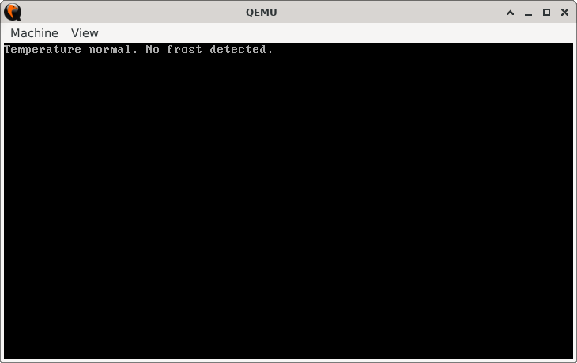
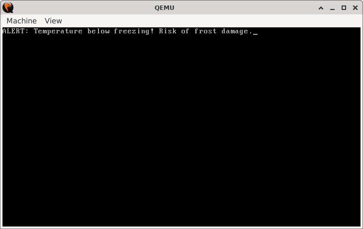

# FrostTrigger

> **Random Quote**: Persistence guarantees that results are inevitable.

## Sections

+ [Overview](#overview)
    - [Objectives](#objectives)
+ [How It Works](#how-it-works)
+ [Practice Areas](#practice-areas)
+ [Running the Project](#running-the-project)
+ [Output and Explanation](#output-and-explanation)
+ [Notes](#notes)

---

## Overview

This project simulates a temperature monitoring system that raises an alert if the temperature drops below freezing (0°C). It demonstrates how to use signed comparisons in x86 assembly with the `JL` instruction, which checks if a signed value is less than another.

### Objectives

+ Define a signed temperature constant and compare it against freezing point.
+ Use `CMP` with signed conditional jumps (`JL`) to detect sub-zero values.
+ Print different messages depending on whether the temperature is safe or below freezing.  

---

## How It Works

1. Set the screen to text mode (80x25).  
2. Load the current temperature into the `AL` register.  
3. Compare it with the freezing point (`0`).  
4. If the temperature is less than zero, jump to the **trigger_alarm** routine.  
5. Otherwise, jump to the **safe_temp** routine.  
6. Print the appropriate message using the custom string-printing function.  
7. Halt the CPU.  

---

## Practice Areas

+ Using `CMP` with signed comparison instructions (`JL`, `JGE`).  
+ Understanding how signed numbers are represented in two’s complement.  
+ Writing and calling reusable print functions.  
+ Practicing structured branching in assembly.  
+ Implementing a simple monitoring system in a bootloader-sized program.  

---

## Running the Project

To run the bootloader, execute the `run.sh` script.

```sh
./run.sh
```

The script uses `NASM` to assemble `main.asm` into a bootable flat binary (`main.img`) and launches it in QEMU for testing.

---

## Output and Explanation

Example output if `TEMP = 2`:



Example output if `TEMP = -5`:



This confirms that the program correctly distinguishes between safe and sub-zero signed values.

---

## Notes

* Remember that `EQU -5` produces the two’s complement byte (`0xFB`) internally, which `JL` interprets correctly as a negative number.
* This project is a good stepping stone to learning how signed comparisons differ from unsigned ones (`JL` vs. `JB`).
* If you want to simulate extreme cold, try assigning `TEMP EQU -128`.

---
