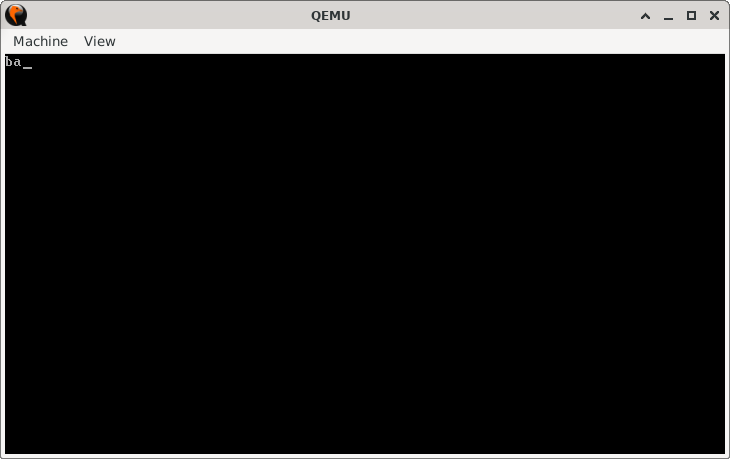

# FullStack

> **Random Quote**: Opportunities don't happen. You create them.

## Sections

+ [Overview](#overview)
    - [Objectives](#objectives)
+ [How It Works](#how-it-works)
+ [Practice Areas](#practice-areas)
+ [Running the Project](#running-the-project)
+ [Output and Explanation](#output-and-explanation)
+ [Notes](#notes)

---

## Overview

This project demonstrates how to use the stack to both preserve a register’s value and restore it later. It shows how a character can be saved with `PUSH`, replaced, and then restored with `POP`.

### Objectives

+ Preserve the initial value of the `AL` register on the stack.
+ Modify `AL` and print its new value.
+ Restore the original value from the stack and print it again.
+ Practice using `CALL` and `RET` to organize code into subroutines.

---

## How It Works

1. The video mode is set and the screen is cleared (`INT 10h` with mode 03h).  
2. The character `'a'` is loaded into `AL` and pushed onto the stack to preserve it.  
3. `AL` is then changed to `'b'` and printed using the `print` subroutine.  
4. The preserved value (`'a'`) is popped back into `AL`.  
5. The original character is printed again.  
6. The CPU halts after execution.

---

## Practice Areas

+ Using the stack (`PUSH` / `POP`) to save and restore register values.  
+ Calling and returning from subroutines with `CALL` and `RET`.  
+ Printing characters with BIOS interrupt `INT 10h`.  
+ Structuring minimal real-mode programs with a boot sector layout.  

---

## Running the Project

To run the bootloader, execute the `run.sh` script.

```sh
./run.sh
```

The script uses `NASM` to assemble `main.asm` into a bootable flat binary (`main.img`) and launches it in QEMU for testing.

---

## Output and Explanation

This is the output when you run the program:



Explanation:

* The first printed character is `'b'`, showing the modified value of `AL`.
* The second printed character is `'a'`, confirming that the original value was successfully restored from the stack.

---

## Notes

* This project demonstrates a fundamental stack use case: temporary storage for registers across code execution.
* The `print` subroutine uses BIOS teletype mode (`AH = 0Eh`), which directly prints the character in `AL` to the screen.

---
