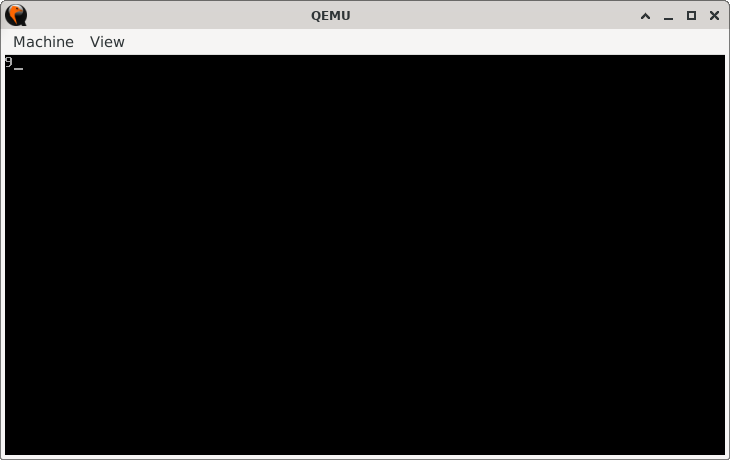

# Add Two Numbers

> **Random Quote:** Success isn't always about greatness. It's about consistency. Consistent hard work leads to success. Greatness will come.

## Sections

+ [Overview](#overview)
    - [Objectives](#objectives)
+ [How It Works](#how-it-works)
+ [Practice Areas](#practice-areas)
+ [Running the Project](#running-the-project)
+ [Output and Explanation](#output-and-explanation)
+ [Notes](#notes)

---

## Overview

This project demonstrates how to add two constants in 16-bit real mode and display the result on the screen using BIOS interrupts. It focuses on arithmetic operations and ASCII conversion necessary for printing numerical output to the screen.

### Objectives

+ Add two predefined numbers using the `ADD` instruction.
+ Convert the result to its ASCII character equivalent.
+ Display the result using BIOS `INT 10h`.

---

## How It Works

+ Set the video mode to `80x25 color text mode` using `INT 10h, AH=0x00`.
+ Add the two numbers.
+ Convert the sum to its ASCII representation by adding `'0'`.
+ Print the sum using BIOS `INT 10h, AH=0x0E`.
+ Halt.

---

## Practice Areas

+ Using `ADD` to perform basic arithmetic.
+ Converting integers to ASCII for output.
+ Printing characters using BIOS interrupts (`INT 10h`).
+ Writing and booting a minimal 16-bit real mode program.

---

## Running the Project

To run the bootloader, execute the `run.sh` script.

```bash
./run.sh
```

The script uses `NASM` to assemble `main.asm` into a bootable flat binary (`main.img`) and launches it in QEMU for testing.

---

## Output and Explanation

When you run the program, you'll get this output:



### What This Means

The output displays `9`, the result of adding `7` and `2`.

---

## Notes

+ This example assumes that the result will always be a single-digit number (`1-9`). Handling multi-digit results would require additional logic to extract and display each digit individually. For a project that demonstrates this, see [this project](../02_difference_finder/README.md).

+ If you're unfamiliar with how to convert an integer into a string for display purposes, refer to [this file](../../../Q&A/03_convert_integer_to_string.md) for a detailed tutorial with examples.

---
