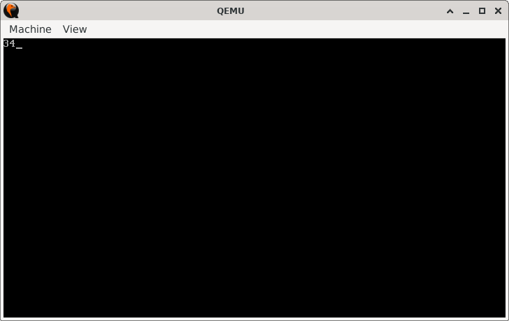

# Difference Finder

> **Random Quote**: You don't learn how to swim by reading about water.

## Sections

+ [Overview](#overview)
    - [Objectives](#objectives)
+ [How It Works](#how-it-works)
+ [Practice Areas](#practice-areas)
+ [Running the Project](#running-the-project)
+ [Output and Explanation](#output-and-explanation)
+ [Notes](#notes)

---

## Overview

This project demonstrates a 16-bit bootloader that performs subtraction of two numbers, converts the result into a human-readable ASCII string using stack operations, and prints it on the screen via BIOS interrupts.

### Objectives

+ Subtract two hardcoded unsigned 16-bit numbers.
+ Convert the result to a decimal ASCII string.
+ Print the result using BIOS teletype output.
+ Ensure the code fits into a valid 512-byte boot sector.

---

## How It Works

1. Set video mode `0x03` (80x25 text mode) using BIOS `INT 10h`.
2. Store the difference of two integers into `AX`.
3. Divide the result in `AX` by 10 repeatedly to extract decimal digits (using `DIV`).
4. Convert each digit to ASCII by adding `'0'` and push to the stack.
5. Use a loop and `INT 10h, AH=0x0E` to pop and print each character.
6. End the program in an infinite loop to prevent running into garbage.

---

## Practice Areas

+ Using `SUB` for unsigned arithmetic.
+ Integer-to-string conversion using repeated division.
+ Stack usage to reverse digits for correct printing order.
+ BIOS video services (`INT 10h`, AH = `0x0E`).
+ Writing minimal bootable code (512 bytes with boot signature).

---

## Running the Project

To run the bootloader, execute the `run.sh` script.

```sh
./run.sh
```

The script uses `NASM` to assemble `main.asm` into a bootable flat binary (`main.img`) and launches it in QEMU for testing.

---

## Output and Explanation

This is the output you get when you run the program:



This output confirms that the program correctly subtracted 89 from 123 and converted the result (34) into a printable string. The digits appear in the right order due to stack-based reversal.

---

## Notes

* The program currently does not handle negative results because `SUB` is limited to unsigned numbers.

---
