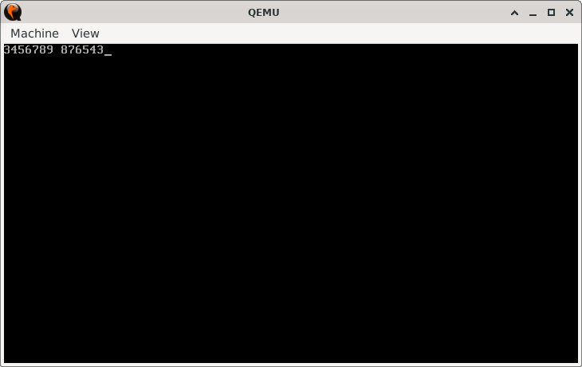

# Climb and Drop

> **Random Quote:** Don't stop when you're tired. Stop when you're done.

## Sections

+ [Overview](#overview)
    - [Objectives](#objectives)
+ [How It Works](#how-it-works)
+ [Practice Areas](#practice-areas)
+ [Running the Project](#running-the-project)
+ [Output and Explanation](#output-and-explanation)
+ [Notes](#notes)

---

## Overview

This project demonstrates how to increment a variable in memory from its original value up to 9, printing each step, and then decrement it back to the original value while printing again.

### Objectives

+ Store an initial value in memory (0 <= num < 9).
+ Increment it to 9, printing each value.
+ Print a space.
+ Decrement it back to the original value, printing each step.
+ Halt the CPU.

---

## How It Works

1. Set the video mode to 80x25 text.
2. Load the initial value from memory into `AL`.
3. Print the original value.
4. Increment `AL` until it equals 9:
   + After each increment, print the value.
5. Print a space to separate the phases.
6. Decrement `AL` back to the original value:
   + After each decrement, print the value.
7. Halt the CPU.

Supporting routines:
+ `print_number`: Converts number in `AL` to ASCII and prints it using `INT 10h`.
+ `print`: BIOS teletype output for a single character.

---

## Practice Areas

+ Repeated use of `INC` and `DEC` on register-loaded memory.
+ Conditional loops using `CMP`, `JE`, and `JMP`.
+ ASCII conversion with `'0'` offset.
+ BIOS interrupts for screen output (`INT 10h`, `AH=0x0E`).
+ Real-mode boot sector structuring (`ORG 0x7C00`, `times`, `0xAA55` signature).

---

## Running the Project

To run the bootloader, execute the `run.sh` script.

```sh
./run.sh
```

The script uses `NASM` to assemble `main.asm` into a bootable flat binary (`main.img`) and launches it in QEMU for testing.

---

## Output and Explanation

This is the output you get when you run the program:



Explanation:

* `3` is printed (original value).
* Increment to 9: prints 4,5,6,7,8,9.
* Prints a space.
* Decrements: prints 8,7,6,5,4,3.

The output confirms that the value was incremented and then restored using symmetric logic.

---

## Notes

* You can change the starting value in the `num` byte at the end of the file. It **must be less than 9**.
* Stack is used minimally (for preserving `AX` during printing).
* A future improvement could involve checking if `num` is ≥ 9 and printing an error message or halting early.

---
