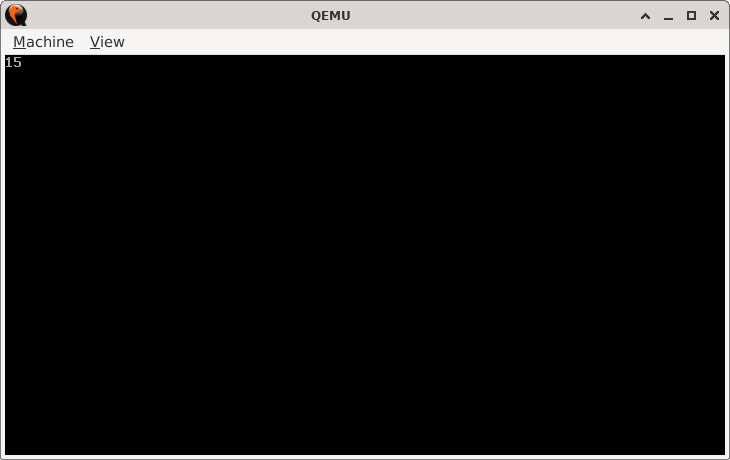

# Accumuloop

> **Random Quote:** Do not go where the path may lead, go instead where there is no path and leave a trail.

## Sections

+ [Overview](#overview)
    - [Objectives](#objectives)
+ [How It Works](#how-it-works)
+ [Practice Areas](#practice-areas)
+ [Running the Project](#running-the-project)
+ [Output and Explanation](#output-and-explanation)
+ [Notes](#notes)

---

## Overview

This project calculates the sum of the first *n* natural numbers using a loop and displays the result using BIOS interrupts.

### Objectives

+ Use a loop to compute an arithmetic sum: `1 + 2 + ... + n`.
+ Convert the numeric result into a printable string.
+ Display the string using BIOS `INT 10h`.
+ Fit the entire logic in 512 bytes.

---

## How It Works

1. BIOS video mode is initialized (80x25 color text mode).
2. Registers are cleared and a loop runs from 1 to `n`, accumulating the sum in `AX`.
3. The result is converted to ASCII digits by repeatedly dividing by 10 and pushing the remainders onto the stack.
4. Digits are popped and printed in correct order using BIOS teletype output.
5. The CPU is halted.

---

## Practice Areas

+ Looping and conditional jumps (`CMP`, `JE`, `JMP`).
+ Basic arithmetic (`ADD`, `INC`, `DIV`, `XOR`).
+ Stack usage to reverse strings (`PUSH`, `POP`).
+ BIOS interrupt calls (`INT 10h`).
+ Real-mode program structure and boot sector layout.

---

## Running the Project

To run the bootloader, execute the `run.sh` script.

```bash
./run.sh
```

The script uses `NASM` to assemble `main.asm` into a bootable flat binary (`main.img`) and launches it in QEMU for testing.

---

## Output and Explanation

This is the output I got when I ran the program:




The `num` variable was set to `5`. Therefore, the output is `1 + 2 + 3 + 4 + 5` which is `15`.
This confirms correct loop behavior and number-to-string conversion.

---

## Notes

* The value of `n` is stored in the `num` variable at the end of the file. You can change it to any small number (e.g., `10`, `25`) to see a different result.
* The conversion avoids using multiplication or string libraries; just raw division and ASCII math.
* The project demonstrates a hands-on approach to understanding how higher-level constructs like loops and printing are built from scratch.

---
