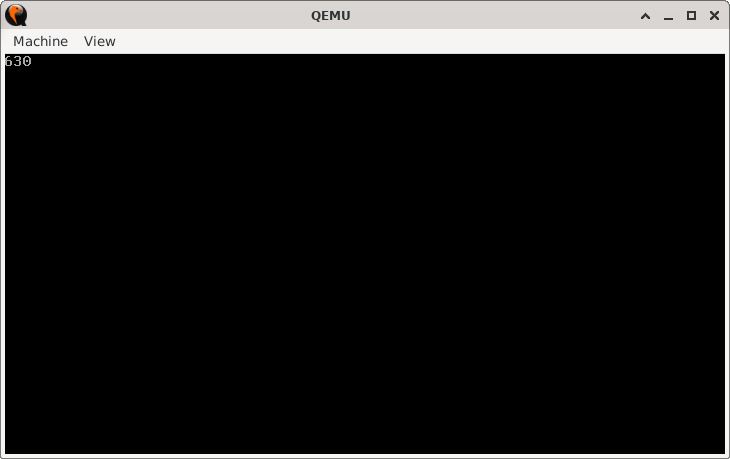

# BitMultiplier

> **Random Quote**: Do not wait; the time will never be 'just right.' Start where you stand.

## Sections

+ [Overview](#overview)
    - [Objectives](#objectives)
+ [How It Works](#how-it-works)
+ [Practice Areas](#practice-areas)
+ [Running the Project](#running-the-project)
+ [Output and Explanation](#output-and-explanation)
+ [Notes](#notes)

---

## Overview

This project demonstrates multiplication in 16-bit real mode assembly using the **shift-and-add** method.  
Instead of using the `MUL` instruction, it repeatedly shifts and adds the multiplicand to build the product.

### Objectives

+ Implement multiplication using only bitwise shifts and addition.
+ Print the result to the screen using BIOS interrupts.
+ Reinforce understanding of binary arithmetic and bitwise operations.

---

## How It Works

1. Set the video mode to clear the screen.
2. Load the multiplicand into `CX` and the multiplier into `BX`.
3. Initialize `AX` as the result accumulator.
4. Loop through the multiplier:
   - If the lowest bit of `BX` is set, add `CX` to `AX`.
   - Shift `CX` left by one (multiply by 2).
   - Shift `BX` right by one (divide by 2).
   - Repeat until `BX` becomes zero.
5. Convert the result in `AX` into decimal digits by dividing by 10.
6. Push each digit onto the stack, then pop and print them in correct order.
7. Halt the CPU.

---

## Practice Areas

+ Using `SHL` and `SHR` to perform bitwise multiplication and division.
+ Implementing multiplication without the `MUL` instruction.
+ Using `TEST` and conditional jumps for decision-making.
+ Converting binary results into ASCII digits.
+ Printing characters via BIOS interrupt `INT 10h`.

---

## Running the Project

To run the bootloader, execute the `run.sh` script.

```sh
./run.sh
```

The script uses `NASM` to assemble `main.asm` into a bootable flat binary (`main.img`) and launches it in QEMU for testing.

---

## Output and Explanation

Output when `MULTIPLICAND = 63` and `MULTIPLIER = 10`:



The output confirms that the algorithm correctly multiplied 63 by 10 using only shifts and additions.

---

## Notes

* Refer to [this file](../../../Q&A/10_shift_and_addition_multiplication.md) for a step-by-step explanation of how multiplication can be implemented using bitwise shifts.
* The result is stored in `AX`, so the maximum product must not exceed 65,535.
* The stack is used to reverse the digits during number printing.
* This project is a stepping stone to implementing other arithmetic routines (like division) without relying on built-in instructions.

---
