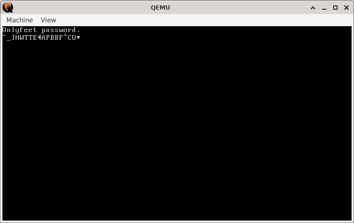

# BitCipher

> **Random Quote**: Knowing yourself is the beginning of all wisdom.

## Sections

+ [Overview](#overview)
    - [Objectives](#objectives)
+ [How It Works](#how-it-works)
+ [Practice Areas](#practice-areas)
+ [Running the Project](#running-the-project)
+ [Output and Explanation](#output-and-explanation)
+ [Notes](#notes)

---

## Overview

This project demonstrates a simple **XOR-based cipher** in 16-bit real mode assembly.  
The program takes a plaintext string, prints it, encrypts it by XOR-ing each character with a key, and then prints the encrypted result.  
Since XOR encryption is symmetrical, applying the same operation again with the same key decrypts the string.

### Objectives

+ Implement a toy cipher using the `XOR` instruction.  
+ Practice string traversal and null-termination handling.  
+ Display both the original and encrypted strings using BIOS interrupts.  

---

## How It Works

1. Set video mode `0x03` to clear the screen.  
2. Load the plaintext string (`password`) and calculate its length.  
3. Print the original string using BIOS interrupt `INT 10h`.  
4. Encrypt the string in-place:
   - Load each character.  
   - XOR it with the key.  
   - Overwrite the character in memory.  
   - Continue until the null terminator is reached.  
5. Move the cursor to the next line and print the encrypted string.  
6. Halt the CPU.  

---

## Practice Areas

+ Using the `XOR` instruction for simple cryptographic operations.  
+ Traversing and modifying null-terminated strings in memory.  
+ Implementing a custom string length counter.  
+ Printing characters with BIOS `INT 10h` teletype output.  
+ Practicing in-place memory modification.  

---

## Running the Project

To run the bootloader, execute the `run.sh` script.

```sh
./run.sh
```

The script uses `NASM` to assemble `main.asm` into a bootable flat binary (`main.img`) and launches it in QEMU for testing.

---

## Output and Explanation

Output with the string `"Onlyfeet password."` and key `"1"`:



The program first prints the original string, then prints the encrypted string on the next line.
The scrambled second line confirms that XOR with the key modified each character.

If the encrypted string were passed back through the same routine with the same key, it would decrypt back to the original plaintext.

---

## Notes

* The encryption key is a single ASCII character defined by `KEY equ "1"`.
* This is a **toy cipher**; XOR encryption with a single-byte key is trivially breakable and not secure in real-world scenarios.
* The program modifies the original string **in-place**; after encryption, the plaintext is no longer available in memory.
* Extending the project to use multi-byte keys or rotated masks could make the exercise more challenging.

---
