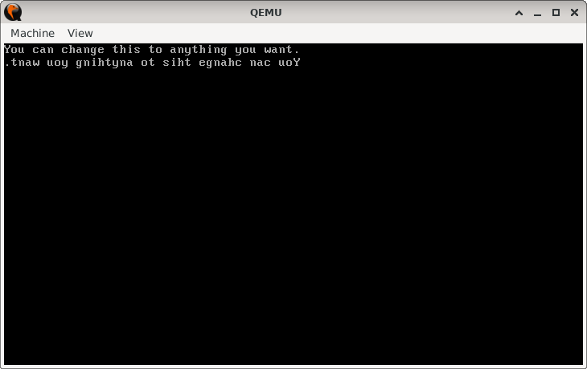

# MirrorString

> **Random Quote**: Life is not about how fast you run or how high you climb, but how well you bounce.

## Sections

+ [Overview](#overview)  
    - [Objectives](#objectives)  
+ [How It Works](#how-it-works)  
+ [Practice Areas](#practice-areas)  
+ [Running the Project](#running-the-project)  
+ [Output and Explanation](#output-and-explanation)  
+ [Notes](#notes)  

---

## Overview

This project demonstrates how to print a string stored in memory both in its normal order and in reverse. It makes practical use of string instructions (`LODSB`) combined with BIOS interrupts for character output in real-mode assembly.

### Objectives

+ Print a null-terminated string stored in memory using `LODSB`.  
+ Print a newline after the forward string.  
+ Print the same string again, this time in reverse order.  

---

## How It Works

1. The bootloader sets the video mode (text mode 80x25).  
2. `SI` is loaded with the address of the message string.  
3. The string is printed one character at a time using `LODSB` until a null terminator (`0`) is found.  
4. A newline is printed by sending carriage return (`0Dh`) and line feed (`0Ah`) characters via BIOS interrupt `10h`.  
5. A helper routine computes the length of the string and stores it in memory.  
6. `SI` is advanced to the end of the string (just before the null terminator).  
7. The Direction Flag is set (`STD`), causing `LODSB` to move backward through memory.  
8. The string is printed again in reverse order until the beginning of the string is reached.  
9. The program halts the CPU.  

---

## Practice Areas

+ Using the `LODSB` instruction to read characters from memory sequentially.  
+ Manipulating the Direction Flag (`DF`) with `CLD` and `STD` to control forward vs. backward iteration.  
+ Implementing a string length routine in assembly.  
+ Using BIOS interrupt `10h` (teletype output) to display characters on screen.  
+ Structuring a minimal bootloader program that demonstrates multiple concepts in one flow.  

---

## Running the Project

To run the bootloader, execute the `run.sh` script.

```sh
./run.sh
```

The script uses `NASM` to assemble `main.asm` into a bootable flat binary (`main.img`) and launches it in QEMU for testing.

---

## Output and Explanation

Example output on screen:



Explanation:

* The first line is the string printed normally using forward iteration (`CLD`, `LODSB`).
* The second line is the same string printed in reverse order using backward iteration (`STD`, `LODSB`).

This confirms that both forward and reverse string operations are working correctly.

---

## Notes

* This project highlights how a single instruction (`LODSB`) can traverse memory in two directions depending on the Direction Flag.
* The length calculation routine provides a reusable way to measure null-terminated strings in real-mode assembly.
* Modifying the `message` string in memory automatically updates the program’s behavior without changing the code.

---
