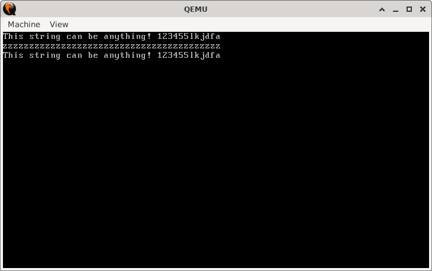

# ZBlock

> **Random Quote**: The greatest accomplishment is not in never falling, but in rising again after you fall.

## Sections

+ [Overview](#overview)
    - [Objectives](#objectives)
+ [How It Works](#how-it-works)
+ [Practice Areas](#practice-areas)
+ [Running the Project](#running-the-project)
+ [Output and Explanation](#output-and-explanation)
+ [Notes](#notes)

---

## Overview

This project demonstrates memory block manipulation in real-mode assembly using string instructions.  
The program first fills a memory region with `'z'` characters using `REP STOSB`. It then copies a source string into the same memory region using `REP MOVSB` and displays the results before and after the copy.

### Objectives

+ Fill a block of memory with a repeated character using `REP STOSB`.
+ Print the memory block to verify the contents.
+ Copy a string from one memory area to another using `REP MOVSB`.
+ Print the modified memory block to verify the copy.

---

## How It Works

1. Print the original string stored in memory (`string`).
2. Determine the length of the string with a helper routine (`get_string_len`).
3. Use `REP STOSB` to fill the target memory block (`zblock`) with `'z'` characters.
4. Print the contents of the filled memory block to confirm it was written.
5. Use `REP MOVSB` to copy the original string into the same memory block.
6. Print the memory block again, now containing the copied string.
7. Halt execution.

---

## Practice Areas

+ Using `REP STOSB` to fill memory with a repeating value.
+ Using `REP MOVSB` to copy blocks of memory.
+ Calculating string length in real mode.
+ Displaying strings with BIOS interrupt `INT 10h`.
+ Structuring a minimal bootloader program.

---

## Running the Project

To run the bootloader, execute the `run.sh` script.

```sh
./run.sh
```

The script uses `NASM` to assemble `main.asm` into a bootable flat binary (`main.img`) and launches it in QEMU for testing.

---

## Output and Explanation

Example output:



Explanation:

* The first line shows the original string stored in memory.
* The second line shows the block of memory filled with `'z'` characters.
* The third line shows the same block after the original string was copied into it.

---

## Notes

* `REP STOSB` is useful for quickly initializing or clearing memory buffers.
* `REP MOVSB` is a fundamental tool for implementing memory copying routines.
* This project lays the groundwork for more advanced bootloader functionality, such as moving kernel code into memory.
* Be aware that `zblock` is defined as a single `db 0` in this example. The size is implicitly handled by the string length, but in a real project, you may want to reserve a fixed buffer with `times` or `resb`.

---
