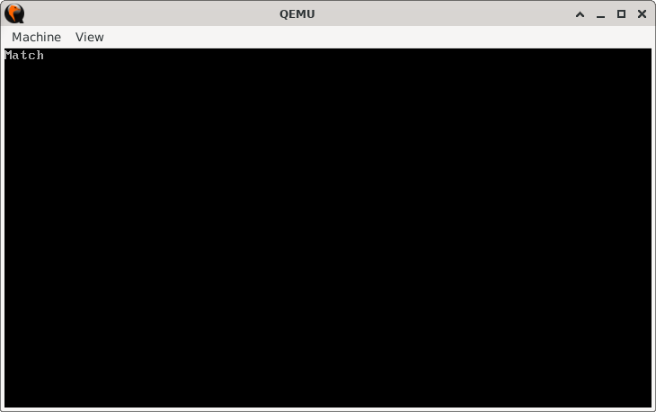
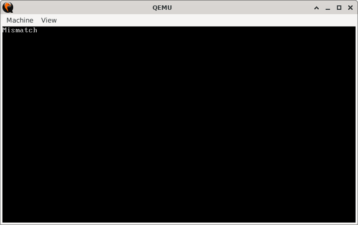

# TwinCheck

> **Random Quote**: Strength does not come from winning. Your struggles develop your strengths.

## Sections

+ [Overview](#overview)
    - [Objectives](#objectives)
+ [How It Works](#how-it-works)
+ [Practice Areas](#practice-areas)
+ [Running the Project](#running-the-project)
+ [Output and Explanation](#output-and-explanation)
+ [Notes](#notes)

---

## Overview

This project compares two strings stored in memory using the `CMPSB` instruction combined with the `REPE` prefix. The program prints whether the two strings are equal or not.  

### Objectives

+ Compare two memory strings byte by byte.  
+ Print "Match" if the strings are identical.  
+ Print "Mismatch" if the strings differ.  

---

## How It Works

1. The program sets the video mode and clears the screen using BIOS interrupt `INT 10h`.  
2. It loads the first string into `SI` and calculates its length using the `get_string_len` function.  
3. The second string is loaded into `DI`, and the length of the first string is stored in `CX`.  
4. The instruction `REPE CMPSB` compares both strings byte by byte until either:  
   + A mismatch is found, or  
   + All characters match and `CX` reaches zero.  
5. The program checks if `CX` is zero. If yes, the strings are equal, and it prints **Match**. Otherwise, it prints **Mismatch**.  
6. The program halts execution.  

---

## Practice Areas

+ Using the `CMPSB` string comparison instruction.  
+ Applying the `REPE` prefix to repeat comparisons automatically.  
+ Working with BIOS interrupts (`INT 10h`) for output.  
+ Implementing basic string-handling routines in 16-bit real mode.  
+ Structuring small, testable assembly projects.  

---

## Running the Project

To run the bootloader, execute the `run.sh` script.

```sh
./run.sh
```

The script uses `NASM` to assemble `main.asm` into a bootable flat binary (`main.img`) and launches it in QEMU for testing.

---

## Output and Explanation

Output when:

```assembly
first_string  db "Sample string.", 0
second_string db "Sample string.", 0
```



This output occurs because the strings are exactly the same.

Output when:

```assembly
first_string  db "Sample string.", 0
second_string db "Simple string.", 0
```



This output occurs because there is a mismatch at the second character ("a", "i").

---

## Notes

* Both strings must be of equal length for this implementation, as `get_string_len` only calculates the length of the first string.
* If lengths differ, the program may not behave as expected.
* This project is a foundation for more advanced string comparison routines, such as case-insensitive checks or partial matching.
* Useful for practicing BIOS teletype output and string instruction handling in bootloader-level programs.

---
